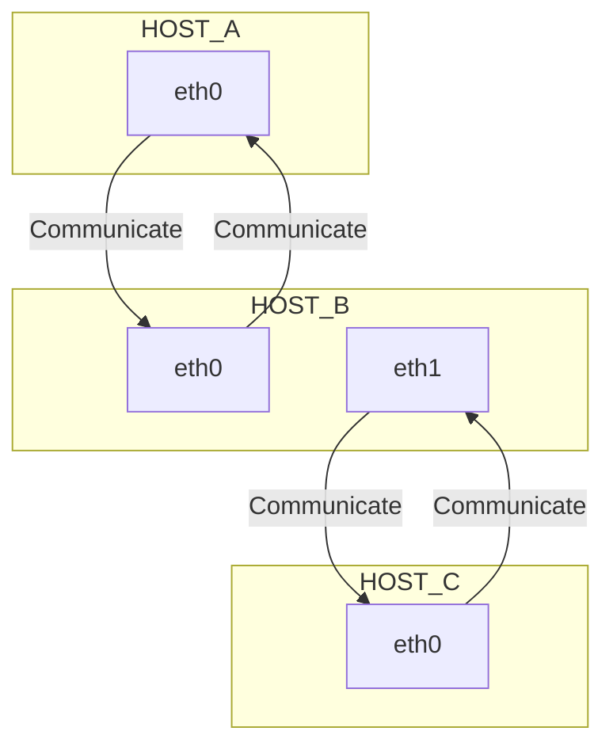

# Test title

something about a

**test bold** _italic_ 

[links](https://github.com/protogia)

```bash
sudo systemctl status your.service
```

```py
import pandas as pd

df = pd.DataFrame()
df.head
```

